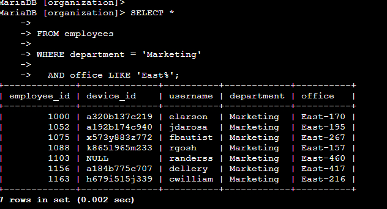

# Apply filters to SQL queries  

---

## Project description  
This project investigates potential security incidents and employee machine updates using SQL queries. Filters were applied to the `log_in_attempts` and `employees` tables to identify failed logins after business hours, logins on specific dates, and logins originating outside of Mexico. Additional queries retrieved employees in specific departments and office locations to support IT and security updates. The objective was to demonstrate how SQL filters can be used to extract relevant data for analysis and operational decision-making.  

---

## Retrieve after hours failed login attempts  
This query retrieves all login attempts that occurred after 18:00 where the attempt was unsuccessful. The filter `login_time > '18:00:00'` restricts results to activity outside of normal business hours, while `success = 0` identifies failed attempts. The `AND` operator ensures both conditions are satisfied.  

  

---

## Retrieve login attempts on specific dates  
This query returns login attempts recorded on either 2022-05-08 or 2022-05-09. The `OR` operator ensures that records from both dates are included in the results. This filter is useful for examining events within a defined timeframe.  

---

## Retrieve login attempts outside of Mexico  
This query identifies login attempts where the `country` field does not begin with “MEX.” The pattern `LIKE 'MEX%'` matches both “MEX” and “MEXICO.” The use of `NOT` excludes those results, ensuring that only attempts from other countries are retrieved.  

  

---

## Retrieve employees in Marketing  
This query retrieves all employees in the Marketing department who are located in offices that begin with “East.” The condition `department = 'Marketing'` ensures the department filter, while `office LIKE 'East%'` captures values such as “East-170” or “East-320.” The `AND` operator requires both conditions to be met simultaneously.  

  

---

## Retrieve employees in Finance or Sales  
This query retrieves records for employees in either the Finance or Sales department. The `IN` clause simplifies the logic compared to multiple `OR` statements by listing the acceptable values directly.  

  

---

## Retrieve all employees not in IT  
This query identifies all employees who are not in the Information Technology department. The `<>` operator specifies that the value of `department` must not equal “Information Technology.”  

  

---

## Summary  
The queries in this project demonstrate how SQL filters can be applied to investigate login activity and employee records. Filters using time and date conditions provided insight into after-hours and event-specific logins. The use of pattern matching with `LIKE` identified records based on partial values, while logical operators `AND`, `OR`, and `NOT` combined or excluded conditions as needed. Together, these queries show how SQL can extract targeted information to support security investigations and IT updates.  
